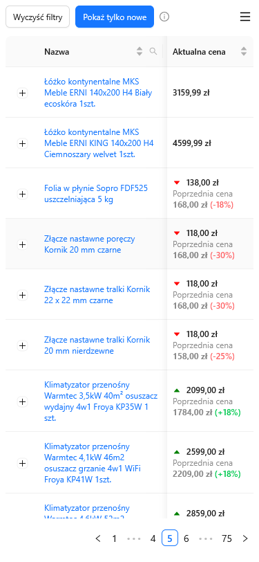
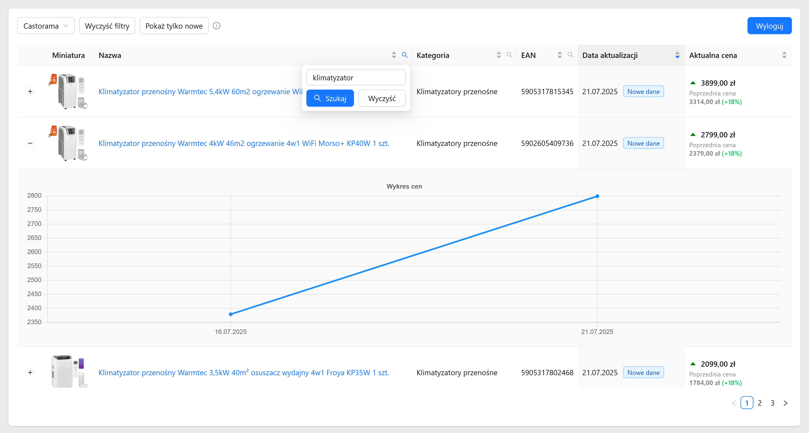

# 🏷️ Scraper Cen Produktów 🏷️

**Scraper Cen** to prosta aplikacja do automatycznego pobierania i monitorowania cen produktów.

Obecnie obsługiwane sklepy (_WIP_):

-   `Castorama`

## 🔍 Funkcje

-   Okresowe pobieranie cen produktów z wybranych sklepów
-   Archiwizacja danych produktowych
-   Responsywny webowy interfejs do prezentacji danych
-   Możliwość łatwej rozbudowy o inne sklepy

## 📸 Podgląd interfejsu




## 🚀 Technologie

### Frontend

[Repozytorium z frontendem](https://github.com/filip-stepien/scraper-cen-frontend)

-   **React** – interfejs użytkownika
-   **Komponenty Ant Design** – gotowe komponenty UI
-   **Tailwind CSS** – stylowanie interfejsu

### Backend

-   **Node.js + Express.js** – API obsługujące logikę aplikacji
-   **node-cron** – automatyczne scrapowanie danych w określonych interwałach czasowych
-   **SQLite** – baza do przechowywania cen i produktów
-   **Drizzle ORM** – komunikacja z bazą danych
-   **JWT** – autoryzacja oparta na tokenach

## ⚙️ Instalacja i uruchomienie

### Lokalna instalacja i uruchomienie aplikacji

1. Zainstaluj zależności:

    ```bash
    npm install
    ```

2. Uruchom aplikację:

    ```bash
    npm start
    ```

Aplikacja domyślnie uruchomi się na porcie `3000`.

### Webowy interfejs

Najłatwiej pobrać gotową wersję aplikacji wraz ze zbudowanym frontendem z sekcji [Releases](https://github.com/filip-stepien/scraper-cen/releases).

Alternatywnie możesz:

1. Przejść do [repozytorium frontendu](https://github.com/filip-stepien/scraper-cen-frontend).

2. Pobrać i zbudować frontend - pliki wynikowe pojawią się w katalogu `dist`.

3. Skopiować zawartość katalogu `dist` do folderu `public` w tym repozytorium.

Intefejs jest domyślnie uruchamiany pod adresem `http://localhost:3000`.

### Domyślne dane logowania do panelu

-   Hasło: `admin`

## 🛠️ Konfiguracja

Aplikacja jest konfigurowalna za pomocą pliku `config.json`.

`website` - ustawienia panelu użytkownika:

-   `port` – numer portu, na którym działa aplikacja
-   `authorization` – konfiguracja autoryzacji dostępu:
    -   `enabled` - czy wymagać logowania
    -   `passwordHash` – zahashowane hasło, używane do logowania
-   `session` – ustawienia sesji użytkownika:
    -   `secret` – sekret do podpisywania ciasteczek sesji
    -   `cookieName` – nazwa ciasteczka przechowującego identyfikator sesji
    -   `durationSeconds` – czas życia sesji w sekundach

`db` - ustawienia bazy danych:

-   `fileName` – nazwa pliku bazy danych SQLite
-   `maxPricesCount` – maksymalna liczba zapisanych cen dla jednego produktu

`data` - ustawienia dotyczące danych:

-   `productLookbackHours` – ile godzin wstecz produkty i ceny uznawane są za _nowo dodane_

`scrape` - ustawienia scrapowania:

-   `cron` – [wyrażenie cron](https://en.wikipedia.org/wiki/Cron) definiujące harmonogram automatycznego scrapowania
-   `runOnAppStart` – czy scrapowanie ma się uruchamiać od razu po starcie aplikacji
-   `scheduleOnAppStart` – czy zaplanować zadanie cron od razu po starcie aplikacji

`companies` - konfiguracja scraperów konkretnych stron

> [!NOTE]  
> Hasło w `passwordHash` jest zaszyfrowane przy pomocy algorytmu `bcrypt`. W razie potrzeby zmiany hasła należy wygenerować hash i podmienić go w tym polu.

> [!IMPORTANT]
> Przed uruchomieniem aplikacji należy wygenerować własne hasło (`passwordHash`) oraz unikalny sekret do podpisywania sesji (`secret`), aby zabezpieczyć dostęp do panelu.

## 📄 Licencja

Projekt jest udostępniony w ramach licencji [MIT](https://pl.wikipedia.org/wiki/Licencja_MIT).
